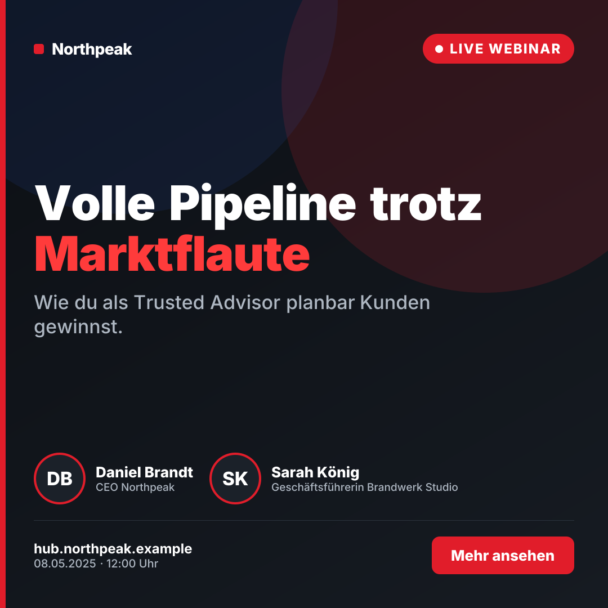
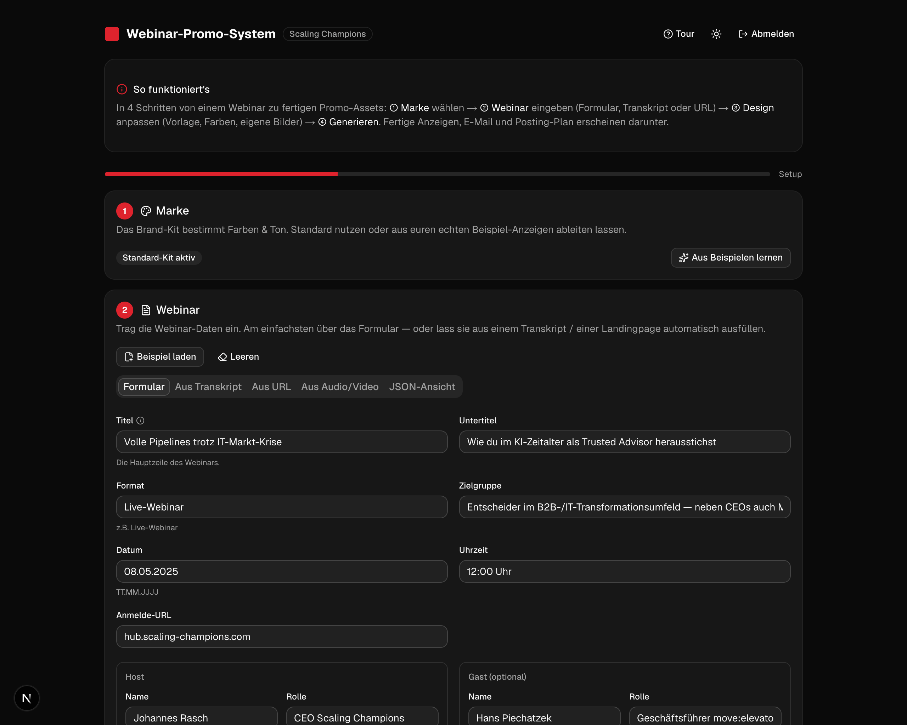
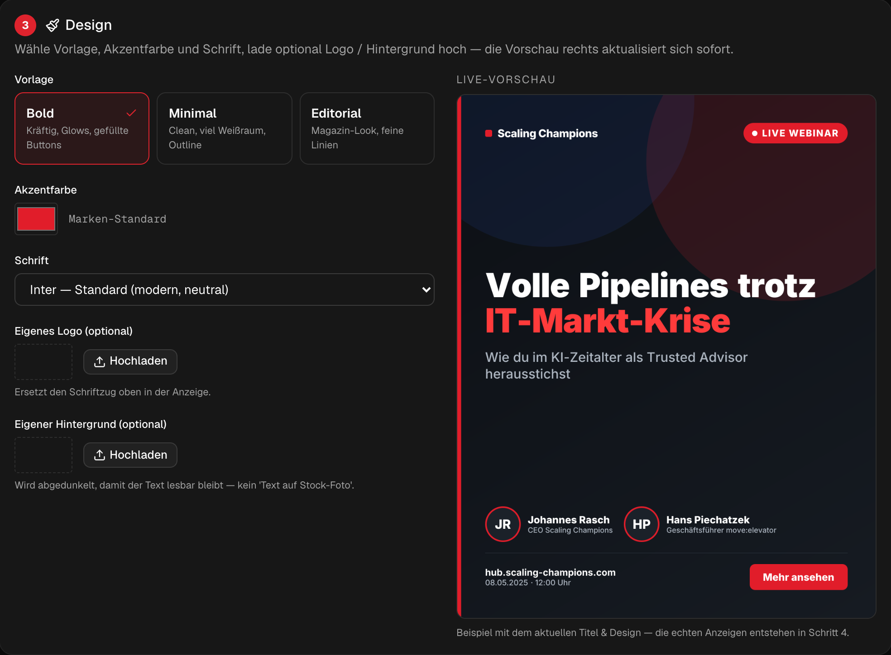

<div align="center">

# 🎯 Webinar-Promo-System

**Webinar rein → fertige Promo-Assets raus.**
Ein wiederverwendbares System, das aus einem Webinar Angles, markenkonforme Anzeigen (Bild + Text, 3 Formate), eine E-Mail-Einladung, einen Qualitäts-Check und einen Posting-Plan erzeugt.

[**▶ Live-Demo**](https://webinar-promo-system.vercel.app) · Built with Next.js 16 · Google Gemini · shadcn/ui

[](https://vercel.com/new/clone?repository-url=https%3A%2F%2Fgithub.com%2FSercan101%2Fwebinar-promo-system&env=GEMINI_API_KEY,APP_PASSWORD,AUTH_TOKEN&envDescription=GEMINI_API_KEY%20ist%20Pflicht.%20APP_PASSWORD%2FAUTH_TOKEN%20optional%20(Login).&envLink=https%3A%2F%2Fgithub.com%2FSercan101%2Fwebinar-promo-system%23environment-variablen)
&nbsp;


  

<sub>3 Design-Vorlagen (Bold · Minimal · Editorial) — alles im Code generiert, kein „Text auf Stock-Foto".</sub>

</div>

---

## 📸 Die Oberfläche

Ein geführter 4-Schritt-Wizard mit Schritt-Validierung, Befehlspalette (⌘K), Onboarding-Tour, Live-Vorschau und Hell/Dunkel-Modus:

 

<sub>Links: geführtes Formular (kein JSON). Rechts: Design-Editor mit Live-Vorschau (Vorlage, Farbe, Schrift, eigene Bilder).</sub>

## ✨ Was es kann

| | Feature |
|---|---|
| 📥 | **Webinar rein, flexibel** — als Formular, **aus PDF-Briefing** (Text oder per Vision/OCR), aus Transkript, aus Landingpage-URL oder **aus einer Audio-/Video-Aufnahme** (Gemini hört zu) |
| 🗜️ | **Uploads werden clientseitig komprimiert** — Bilder verkleinert, Audio/Video auf mono/16 kHz gerechnet & bei Bedarf gekürzt (passt unter API-Limits, spart Quota) |
| 🎨 | **Marke lernen** — leitet das Brand-Kit (Farben, Ton, Copy-Regeln) per Vision aus echten Beispiel-Anzeigen ab |
| 🎯 | **Angle-Lab** — leitet mehrere Angles ab und bewertet jede nach vorhergesagter „Ziehkraft" (0–10); du wählst die stärksten |
| 🖼️ | **Design-Engine** — 3 Vorlagen, eigene Akzentfarbe, eigene Schrift, eigenes Logo & Hintergrundbild — als PNG gerendert (Satori), mit **Live-Vorschau** |
| 📐 | **3 Formate je Anzeige** — 1:1 Feed · 4:5 Feed · 9:16 Story |
| ⭐ | **Qualitäts-Loop** — ein zweiter KI-Pass bewertet jedes Asset (0–10) und bessert schwache automatisch nach |
| 🔀 | **A/B-Varianten** — pro Anzeige eine alternative Copy-Variante zum Testen erzeugen |
| 📧 | **E-Mail-Einladung** — im Stil eurer Beispiele (Problem-Agitate-Solve) |
| 🗓️ | **Posting-Plan** — KI-Sequenz über alle Kanäle + kanal-spezifische Captions, Export als `.ics` / `.csv` / `.md` |
| 📱 | **Feed-Mockup** — Creatives im LinkedIn-/Instagram-Post-Rahmen ansehen |
| 🔌 | **Anbindungen** — Webhook (Make/n8n/Zapier) & Slack |
| ⌨️ | **Befehlspalette** (⌘/Ctrl+K) für alle Aktionen · **⌘/Ctrl+↵** generiert · Schritt-Häkchen & Pflichtfeld-Validierung |
| 🔐 | **Login**, 🌗 **Hell/Dunkel**, 🧭 **Onboarding-Tour**, 💾 **History**, 📋 **Copy-Buttons** |

---

## 🚀 Schnellstart

```bash
git clone https://github.com/<dein-user>/webinar-promo-system.git
cd webinar-promo-system
npm install
cp .env.example .env.local      # GEMINI_API_KEY eintragen (siehe unten)
npm run dev                     # → http://localhost:3000
```

Einen **kostenlosen** Gemini-API-Key gibt's in 1 Minute unter **[aistudio.google.com/apikey](https://aistudio.google.com/apikey)** (kein Billing nötig).

### Environment-Variablen

| Variable | Pflicht | Beschreibung |
|---|---|---|
| `GEMINI_API_KEY` | ✅ | Google Gemini API Key ([hier holen](https://aistudio.google.com/apikey)) |
| `APP_PASSWORD` | – | Passwort fürs Login-Gate. **Leer = offener Modus (kein Login).** |
| `AUTH_TOKEN` | – | Zufalls-Token fürs Cookie (nur wenn `APP_PASSWORD` gesetzt). Generieren: `node -e "console.log(require('crypto').randomBytes(24).toString('hex'))"` |

---

## 🧠 Wie es funktioniert

```
[0] Marke lernen   Vision liest Beispiel-Anzeigen + Mails → brand.json     lib/learn-brand.ts
[1] Webinar rein   Formular · Transkript · URL · Audio/Video → webinar.json lib/extract-webinar.ts
[2] Angles         (Angle-Lab: bewertet & ausgewählt)                       lib/generate.ts
[3] Copy + E-Mail  on-brand, Beispiele als Stil-Anker                       lib/generate.ts
[4] Qualitäts-Loop Bewerten 0–10 → schwache Assets nachbessern              lib/critique.ts
[5] Render         3 Vorlagen × 3 Formate, eigene Bilder/Farben/Schrift     lib/creative.tsx
[6] Posting-Plan   Sequenz + Captions → .ics/.csv                           lib/plan.ts
```

**Designprinzip:** Input (`inputs/webinar.json`) und Logik (`brand/brand.json`) sind sauber getrennt — für ein neues Webinar tauscht man **nur den Input**. Der LLM-Output ist über `responseSchema` **garantiert valides JSON** und wird zusätzlich mit **Zod** geprüft. Robust durch **Modell-Fallback** (`2.5-flash → 2.0-flash → 2.5-flash-lite`).

**Performance & Robustheit:** Die Live-Vorschau rendert nur bei *relevanten* Änderungen neu und cached Ergebnisse (spart API-Quota); Animationen laufen über **LazyMotion** (~5 KB statt 34 KB) und respektieren `prefers-reduced-motion`; schwere Libs (`jszip`, `driver.js`) werden **lazy** geladen; eine **Error-Boundary** fängt unerwartete Fehler ab.

---

## 🖥️ CLI

```bash
npm run learn-brand   # Brand-Kit aus assets/examples/ ableiten → brand.learned.json
npm run generate      # erzeugt output/Zyklus_<webinar>/ (01_Angles … 06_Posting-Plan)
npm run render:test   # Vorlagen-Vorschau nach /tmp rendern (kein LLM)
```

## ☁️ Deployment (Vercel)

```bash
npm i -g vercel
vercel                       # Projekt verknüpfen & deployen
vercel env add GEMINI_API_KEY
```
`next.config.ts` packt via `outputFileTracingIncludes` Fonts, Brand-Kit und die `next/og`-WASM-Binaries in die Functions.

---

## 🗂️ Projektstruktur

| Pfad | Zweck |
|---|---|
| `inputs/webinar.json` | **Input** — pro Webinar tauschen |
| `brand/brand.json` | Marken-DNA (Farben, Ton, Copy-Regeln) |
| `lib/` | `generate` · `critique` · `learn-brand` · `extract-webinar` · `plan` · `creative` (Design-Engine) · `gemini` (REST-Client) · `pipeline` |
| `app/page.tsx` | Geführter Wizard (shadcn/ui) |
| `app/api/*` | generate · render · preview · angles · variant (A/B) · learn-brand · extract-webinar · transcribe · plan · webhook · auth |
| `proxy.ts` | Passwort-Gate (Next 16 Proxy) |
| `scripts/` | `generate-cycle` · `learn-brand` · `showcase` · `test-render` |

---

## 🧰 Tech-Stack

Next.js 16 (App Router) · React 19 · TypeScript · Tailwind v4 · shadcn/ui · Satori (`@vercel/og`) für Bild-Rendering · Google Gemini (REST) · Zod · driver.js (Tour) · next-themes.

> **Hinweis:** Dieses Repo ist mit dem Beispiel **„Scaling Champions"** vorkonfiguriert. Für eine andere Marke einfach `brand/brand.json` und `inputs/webinar.json` ersetzen (oder die Marke per „Aus Beispielen lernen" ableiten lassen).

## 📄 Lizenz

MIT — siehe [LICENSE](LICENSE).
